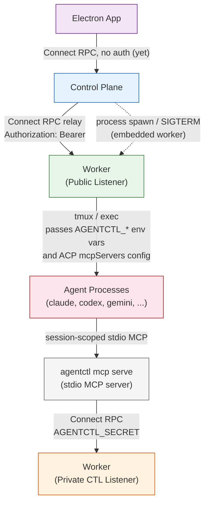
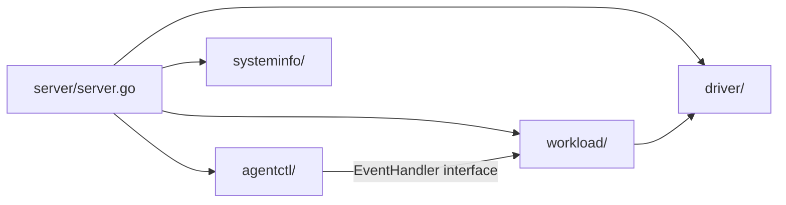

# Architecture: Communication Patterns

| Connection | Transport | Auth | Network |
|---|---|---|---|
| Electron → Control Plane | Connect RPC | None (CORS) | localhost |
| Control Plane → Worker | Connect RPC (relay) | `Authorization: Bearer` header | Tailscale or localhost |
| Control Plane → Worker | Process mgmt (embedded) | Shared secret via env | localhost |
| Worker → Agents | tmux / exec + ACP session config | N/A (env var + mcpServers handoff) | localhost |
| `agentctl mcp serve` → Worker CTL | Connect RPC | `AGENTCTL_SECRET` (ephemeral) | 127.0.0.1 only |

## Worker Internal Packages

- **`driver/`** — Unified interface for coding agents. Each sub-package (`claude`, `codex`, `gemini`, `opencode`) implements the same `Driver` interface, encapsulating agent-specific launch logic, event normalization, and session management. From the outside, all drivers speak the same language.
- **`workload/`** — The heart of the worker. `AgentRunManager` is responsible for spinning up agent sessions, reconciling desired state from the control plane, and keeping sessions alive. It uses `Driver` to launch sessions but owns the lifecycle.
- **`agentctl/`** — Agent-facing RPC service. Provides the Connect RPC endpoints that the session-scoped `agentctl mcp serve` process calls into to set topic and submit plans. Purely an inbound communication layer — delegates all logic to `AgentRunManager` via the `EventHandler` interface.
- **`systeminfo/`** — Agent discovery. Detects which coding agents are available on the system.

The internal flow is: **agentctl RPC → AgentRunManager → Driver**.
